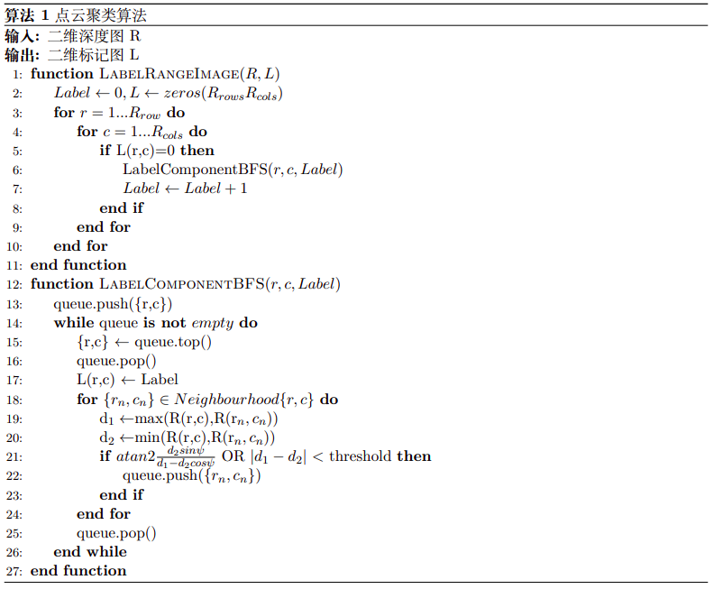

# depth_clustre_ros

> Created by Alex Su 08/05/2020

This is a point cloud clustering segmentation algorithm, including the removal of ground point clouds and the segmentation of point clouds.


## Requirement

- [PCL](https://github.com/PointCloudLibrary/pcl)
- [ROS Kinetic](http://wiki.ros.org/kinetic/Installation/Ubuntu)

## Compile

You can use the following commands to download and compile the package.

```
cd ~/catkin_ws/src
https://github.com/supengufo/depth_clustre_ros
cd ..
caktin_make
```

## Run

run the launch file:

```
cd ~/catkin_ws
source devel/setup.bash(or setup.zsh)
roslaunch depth_cluster_ros depth_cluster_ros.launch
```


## Principles

### Ground Remove


### Cloud Segmentation


First, convert all the 3D points coordinates into 2D depth image;


Then,use Breadth-First-Search(BFS) to extraction point cloud clusters. The algorithm flow chart is as follows:




## Acknowledgements

The main idea of point cloud segmentation is based on depth_cluster, in which the filtering threshold condition and neighborhood search are modified;

The segmentation of ground point clouds is based on Zermas' paper, although principal component analysis is already a very common method to extract ground.

Thank them for their work! 


All these two papers can be found in the `doc` folder.

```
@Article{bogoslavskyi17pfg,
title   = {Efficient Online Segmentation for Sparse 3D Laser Scans},
author  = {I. Bogoslavskyi and C. Stachniss},
journal = {PFG -- Journal of Photogrammetry, Remote Sensing and Geoinformation Science},
year    = {2017},
pages   = {1--12},
url     = {https://link.springer.com/article/10.1007%2Fs41064-016-0003-y},
}
```

```
@inproceedings{Zermas2017Fast,
  title={Fast segmentation of 3D point clouds: A paradigm on LiDAR data for autonomous vehicle applications},
  author={Zermas, Dimitris and Izzat, Izzat and Papanikolopoulos, Nikolaos},
  booktitle={IEEE International Conference on Robotics and Automation},
  year={2017},
}
```

